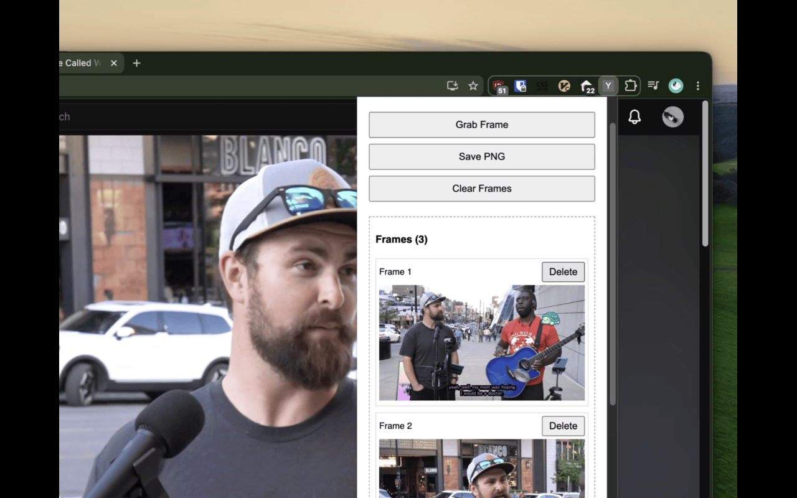
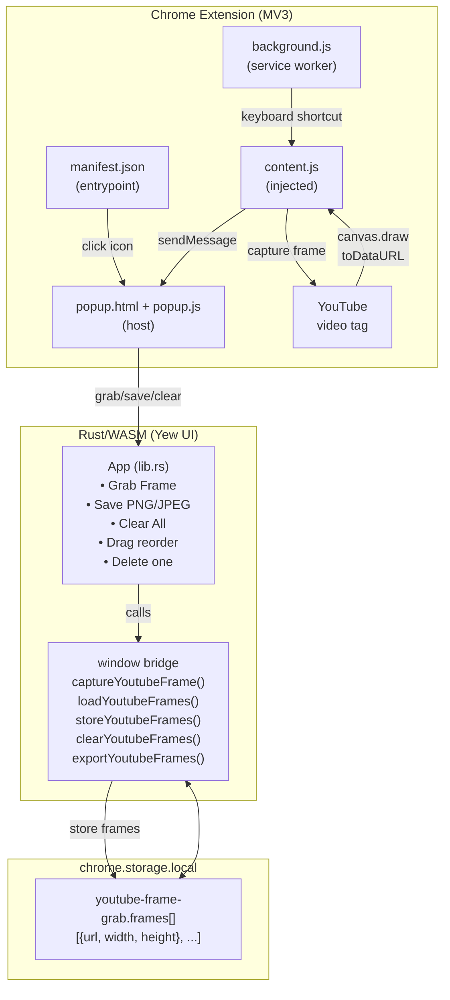

# YouTube Frame Grab

Alpha Chrome extension for capturing frames from YouTube videos and exporting them as a vertical collage.

| Capture frames | Export collage |
| --- | --- |
|  |  |

## Alpha features

- Capture current YouTube video frame from popup
- Keyboard capture: `Ctrl+Shift+G` / `Cmd+Shift+G`
- Keep captured frames across popup close/reopen
- Delete individual frames
- Drag-and-drop frame reordering
- Export vertical collage as PNG or JPEG
- Local-only storage via `chrome.storage.local`

## Build

Prereqs:

- Rust stable
- `wasm32-unknown-unknown` target
- `wasm-pack`
- Node.js
- zip CLI

```bash
rustup target add wasm32-unknown-unknown
cargo install wasm-pack
node build.js
```

Build output:

```text
extension/app.js
extension/app_bg.wasm
release/youtube-frame-grab-alpha-v0.1.0.zip
```

## Technical Architecture

### Mermaid Diagram



## Local install

1. Open `chrome://extensions`
2. Enable Developer mode
3. Click **Load unpacked**
4. Select `extension/`
5. Open a YouTube video
6. Click extension icon and capture frames

## Privacy

See `PRIVACY.md`. Captured frames stay local in Chrome extension storage unless user exports/downloads them.
