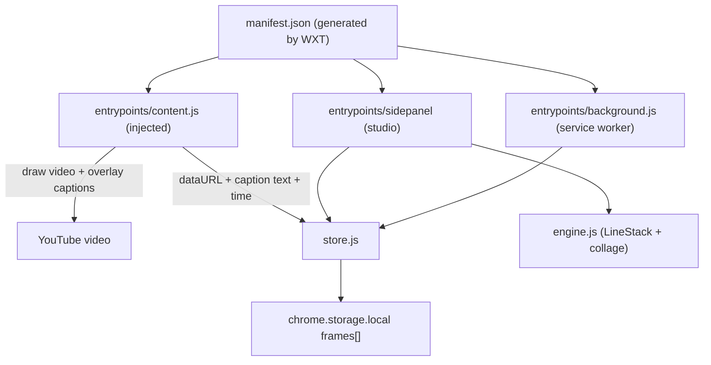

# YouTube LineStack Studio

Alpha Chrome extension (MV3) that captures YouTube video frames **with their
visible captions baked in**, then exports two things:

1. **LineStack** — a subtitle-preserving vertical image. Full "keyframe" shots
   keep their whole frame; "subtitle band" shots keep only the bottom caption
   strip, so a scene's dialogue stacks into one continuous readable image.
2. **Collage** — grid, masonry, or vertical-strip boards from the same frames.

Everything runs locally in the browser — no uploads. Plain JS, bundled with
[WXT](https://wxt.dev).

## Features

- Capture the current YouTube frame with rendered closed captions
- Auto-capture on a configurable interval (0.5s–60s) from the side panel
- Keyboard capture: `Ctrl+Shift+G` / `Cmd+Shift+G`
- Automatic frame classification: caption-visible frames become subtitle bands,
  caption-less frames become keyframes (override per-frame in the queue)
- Drag-and-drop reordering, per-frame type toggle, delete
- LineStack export with adjustable **subtitle crop** ratio, output width,
  optional gap-before-keyframes, watermark, and JPEG quality
- Collage export (grid / masonry / strip) with columns, gap, background,
  corner radius
- Frame cap of 200; local-only storage via `chrome.storage.local`

## How the LineStack logic works

Ported from the LineStack reference tool and adapted for Canvas
(`extension/engine.js`):

```text
scale = outputWidth / naturalWidth
keyframe    -> draw full frame
subtitle    -> crop source bottom band:
                 sy = naturalHeight * (1 - bottomKeepRatio)
                 sh = naturalHeight * bottomKeepRatio
Stack images top-to-bottom on a white canvas; split very tall
outputs into pages (720px: 18000px max, 1080px: 12000px max);
optional watermark bottom-right.
```

Defaults: `bottomKeepRatio 0.2`, `outputWidth 720`, `gapSize 8`, `jpgQuality 0.9`.

## Prototypes

HTML-first prototypes of the whole flow live in `prototypes/`:

- `prototypes/index.html` — hub + distilled logic notes
- `prototypes/prototype-01-linestack.html`
- `prototypes/prototype-02-collage.html`
- `prototypes/prototype-03-extension-flow.html`

Open them with any static server (e.g. `python3 -m http.server` in `prototypes/`).

## Development

The extension is built with [WXT](https://wxt.dev). Prereqs: Node.js 18+.

```bash
npm install       # also runs `wxt prepare`
npm run dev       # dev build with HMR, auto-opens Chrome with the extension
npm run build     # production build -> .output/chrome-mv3/
npm run zip       # Chrome Web Store zip -> .output/*.zip
npm run check     # syntax-check all extension JS
npm test          # unit tests for extension/core.js
```

Layout (WXT `srcDir` is `extension/`):

```text
wxt.config.ts                       manifest overrides (permissions, commands, icons)
extension/
  entrypoints/
    background.js                   service worker (defineBackground)
    content.js                      YouTube page script (defineContentScript)
    sidepanel/index.html, main.js   studio side panel
  public/icons/                     static assets, copied as-is
  core.js  engine.js  store.js  icons.js  studio.css
```

`manifest.json` is generated by WXT from the entrypoints plus `wxt.config.ts`.
The version comes from `package.json`.

## Local install

1. `npm run build`
2. Open `chrome://extensions`
3. Enable Developer mode
4. Click **Load unpacked** and select `.output/chrome-mv3/`
5. Open a YouTube video (turn captions on for subtitle bands)
6. Click the toolbar icon to open the studio side panel directly

Or run `npm run dev`, which launches a browser with the extension loaded and
reloads it on change.

## Architecture (MV3, plain JS via WXT)


```mermaid
flowchart TD
    M["manifest.json (generated by WXT)"] --> SP["entrypoints/sidepanel (studio)"]
    M --> B["entrypoints/background.js (service worker)"]
    M --> C["entrypoints/content.js (injected)"]
    C -->|draw video + overlay captions| YT["YouTube video"]
    C -->|dataURL + caption text + time| STORE["store.js"]
    SP --> STORE
    B --> STORE
    STORE --> LS["chrome.storage.local frames[]"]
    SP --> ENG["engine.js (LineStack + collage)"]
```

## Privacy

See `PRIVACY.md`. Captured frames and exports stay local in Chrome extension
storage unless you export/download them.
